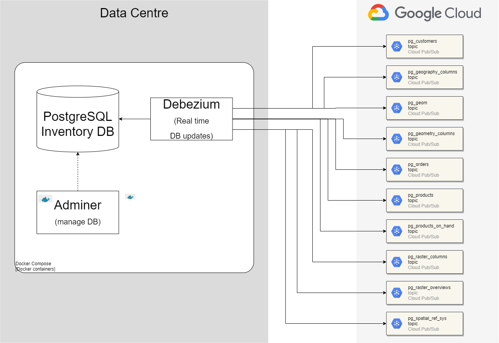

# PoC for Debezium CDC

Version: 0.5.2

This project is a PoC that shows how to do CDC from a PostgreSQL database to Pub/Sub
topics using Debezium.

CDC stands for [Change Data Capture](https://en.wikipedia.org/wiki/Change_data_capture), from Wikipedia:

>In databases, change data capture (CDC) is a set of software design patterns used to determine and track the data that has changed so that action can be taken using the changed data.

[Debezium](https://debezium.io/) is an open source distributed platform for change data capture. Start it up, point it at your databases, and your apps can start responding to all of the inserts, updates, and deletes that other apps commit to your databases. Debezium is durable and fast, so your apps can respond quickly and never miss an event, even when things go wrong.



Debezium Server reads the PostgreSQL write-ahead log and publishes each change to a Pub/Sub topic named `{topic.prefix}.{schema}.{table}`. In this PoC the topic prefix is `db-inventory` and the schema is `inventory`.

The Compose file runs a Pub/Sub emulator on your machine, so the example does not need a Google Cloud project. The `infra/` folder is leftover from an earlier Pulumi and Cloud Build setup and will be removed.

## Prerequisites

- Docker Engine and Compose v2 (`docker compose`)
- Your user in the `docker` group, so Compose does not use `sudo` and does not ask for a password. On this demo machine `sudo` is passwordless, but the commands below do not call it. If `docker compose` says permission denied, the shell was opened before the group was added; run `newgrp docker` or log in again.
- A project virtual environment named `.venv`, used for version bumps and Python checks:

```
python3 -m venv .venv
.venv/bin/pip install bumpversion mypy types-setuptools autopep8
```

## Running this example

From the project root:

```
sg docker -c "docker compose -f postgresql-debezium/docker-compose.yml up"
```

Compose starts five pieces:

- `db-inventory` — `debezium/example-postgres:3.0.0.Final`, the inventory database
- `adminer` — database UI on port 8080
- `pubsub-emulator` — Pub/Sub emulator on port 8085, project `local-debezium`
- `pubsub-init` — creates the topics and pull subscriptions, then exits
- `debezium` — `debezium/server:3.0.0.Final`, which streams the `inventory` schema

Wait until the Debezium log says `Processing messages`:

```
sg docker -c "docker compose -f postgresql-debezium/docker-compose.yml logs -f debezium"
```

The emulator does not create topics when the first message arrives, so Debezium stays stopped until `pubsub-init` has finished. Images are pinned to Debezium `3.0.0.Final` because that is the newest tag still published on Docker Hub.

Debezium reads configuration from environment variables whose names are the property in upper case, with dots turned into underscores. `debezium.sink.type` is `DEBEZIUM_SINK_TYPE`.

Open Adminer at `http://localhost:8080` and log in with:

| Field | Value |
| --- | --- |
| System | PostgreSQL |
| Server | `db-inventory` |
| Username | `postgres` |
| Password | `example` |
| Database | `postgres` |

After login choose `Schema -> inventory`.

Messages are visible on the emulator at `http://localhost:8085`. Pull a subscription and decode `message.data`, which arrives as base64. From the project root:

```
curl -s -X POST \
  "http://localhost:8085/v1/projects/local-debezium/subscriptions/db-inventory.inventory.customers:pull" \
  -H "Content-Type: application/json" \
  -d '{"maxMessages":10}' \
| python3 -c '
import json, sys, base64
data = json.load(sys.stdin)
for message in data.get("receivedMessages", []):
    payload = json.loads(base64.b64decode(message["message"]["data"]))["payload"]
    print(json.dumps({
        "op": payload.get("op"),
        "before": payload.get("before"),
        "after": payload.get("after"),
    }, indent=2))
'
```

`op` is `r` for a row from the first snapshot and `c` for a row inserted later. `after` is the row Debezium sent. The first `customers` snapshot looks like this:

| id | name | email |
| --- | --- | --- |
| 1001 | Sally Thomas | sally.thomas@acme.com |
| 1002 | George Bailey | gbailey@foobar.com |
| 1003 | Edward Walker | ed@walker.com |

The same pull works for the other tables. Change `customers` in the URL to `orders`, `products`, `products_on_hand`, or `geom`.

To confirm a new row, insert through the `db-inventory` service, then pull again. `sg docker` uses the Docker group for that command, so it does not ask for a password. The generated container name is not stable across shells that cannot see the Docker socket. The next pull shows `"op": "c"` and the new name in `after`. The same insert done in Adminer shows up the same way.

```
sg docker -c "docker compose -f postgresql-debezium/docker-compose.yml exec db-inventory psql -U postgres -d postgres -c \"INSERT INTO inventory.customers (first_name, last_name, email) VALUES ('Ada', 'Lovelace', 'ada@example.com');\""
```

## Pub/Sub topics

`pubsub-init` creates one topic and one pull subscription of the same name for each table in the `inventory` schema:

- db-inventory.inventory.customers
- db-inventory.inventory.geom
- db-inventory.inventory.orders
- db-inventory.inventory.products
- db-inventory.inventory.products_on_hand

Subscriptions keep messages for 7 days. The emulator listens on `localhost:8085`.

## Publish to a Google Cloud project

To send events to a real project instead of the emulator:

1. Open the [Google Cloud Console](https://console.cloud.google.com/), select the project, and copy its **Project ID**.
2. Go to **APIs & Services → Library**, search for **Cloud Pub/Sub API**, and enable it.
3. Create each topic in [Pub/Sub topics](#pubsub-topics). For each topic, create a **Pull** subscription with the same id, **Message retention duration** of **7 days**, and **Expiration period** set to **Never expire**.
4. Go to **IAM & Admin → Service Accounts → Create service account**. Grant **Pub/Sub Publisher** (`roles/pubsub.publisher`). Create a JSON key and save it under `postgresql-debezium/keys/`. That directory is gitignored.
5. In `postgresql-debezium/docker-compose.yml`, on the `debezium` service:
   - Set `DEBEZIUM_SINK_PUBSUB_PROJECT_ID` to the Project ID.
   - Remove `DEBEZIUM_SINK_PUBSUB_ADDRESS`.
   - Mount the key read-only and set `GOOGLE_APPLICATION_CREDENTIALS` to `/keys/` plus the file name.
6. Stop the `pubsub-emulator` and `pubsub-init` services, then start Compose again.

## Trunk-based development

`main` is the trunk. Each change is a short-lived branch cut from the latest trunk, opened as a pull request, and deleted after it is fully merged. Branches are not stacked on each other.

Cursor commands in `.cursor/commands/` run that workflow:

- `/commit-work` splits the current work, bumps the version, commits, and pushes a branch
- `/sync-main` fast-forwards the local trunk to `origin`
- `/new-pr` opens the pull request

Agent rules for this repo are in `AGENTS.MD`.

## Manage versions

This repo uses [semantic versioning](https://semver.org/). Every pull request bumps the version with [bumpversion](https://pypi.org/project/bumpversion/):

```
.venv/bin/bumpversion --config-file .bumpversion.cfg major|minor|patch
```

`patch` is a fix or small wording change, `minor` is a new deliverable, and `major` is a breaking change. The command rewrites `version.txt`, the `Version:` line in this file, `.bumpversion.cfg`, and `setup.py`. Do not edit those version numbers by hand.

## Generate project documentation

To generate documentation on your local machine run on the project's root:

```
pydoc-markdown
```

The above command uses configurations stored on file `pydoc-markdown.yaml`. Documentation
will be created in folder `docs`. Refer to [pydoc-markdown](https://pypi.org/project/pydoc-markdown/)
for more information.

## Pep8 compliant code

Format PoC Python with [autopep8](https://pypi.org/project/autopep8/) from the project root, for example:

```
.venv/bin/autopep8 --in-place --exit-code --verbose path/to/module.py
```

It reformats code non-aggressively. Skip `infra/` until that folder is deleted.

## Type check

Type check PoC Python with [mypy](http://www.mypy-lang.org/) from the project root:

```
.venv/bin/mypy path/to/module.py
```

Skip `infra/`. New Python in this repo is type-annotated.
