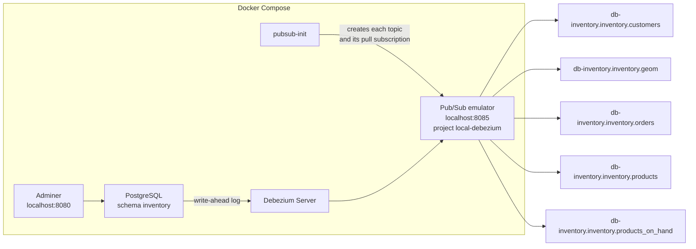
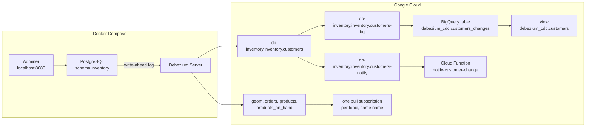

# PoC for Debezium CDC

Version: 0.6.1

This project is a PoC that shows how to do CDC from a PostgreSQL database to Pub/Sub
topics using Debezium.

CDC stands for [Change Data Capture](https://en.wikipedia.org/wiki/Change_data_capture), from Wikipedia:

>In databases, change data capture (CDC) is a set of software design patterns used to determine and track the data that has changed so that action can be taken using the changed data.

[Debezium](https://debezium.io/) is an open source distributed platform for change data capture. Start it up, point it at your databases, and your apps can start responding to all of the inserts, updates, and deletes that other apps commit to your databases. Debezium is durable and fast, so your apps can respond quickly and never miss an event, even when things go wrong.

Debezium Server reads the PostgreSQL write-ahead log and publishes each change to a Pub/Sub topic named `{topic.prefix}.{schema}.{table}`. In this PoC the topic prefix is `db-inventory` and the schema is `inventory`. Debezium captures five tables: `customers`, `geom`, `orders`, `products`, and `products_on_hand`.

There are two ways to run it:

1. [Run the emulator](#run-the-emulator). Nothing is created in Google Cloud. One pull subscription per topic.
2. [Run the complete solution](#run-the-complete-solution). The same five topics in a real project. `db-inventory.inventory.customers` has two subscriptions: one writes the row to BigQuery, and one logs the change.

The `infra/` folder is leftover from an earlier Pulumi and Cloud Build setup and will be removed.

## Prerequisites

- Docker Engine and Compose v2 (`docker compose`)
- Your user in the `docker` group, so Compose does not use `sudo` and does not ask for a password. On this demo machine `sudo` is passwordless, but the commands below do not call it. If `docker compose` says permission denied, the shell was opened before the group was added; run `newgrp docker` or log in again.
- A project virtual environment named `.venv`, used for version bumps and Python checks:

```
python3 -m venv .venv
.venv/bin/pip install -r requirements.dev.txt
```

- Optional: the Google Cloud CLI (`gcloud` and `bq`). The emulator does not need it. The [complete solution](#run-the-complete-solution) does. Install steps are in [Install the Google Cloud CLI](#1-install-the-google-cloud-cli).

## Run the emulator



Each topic has one pull subscription of the same name. Nothing is created in Google Cloud.

From the project root:

```
sg docker -c "docker compose -f postgresql-debezium/docker-compose.yml up"
```

Compose starts five pieces:

- `db-inventory` — `debezium/example-postgres:3.0.0.Final`, the inventory database
- `adminer` — database UI on port 8080
- `pubsub-emulator` — Pub/Sub emulator on port 8085, project `local-debezium`
- `pubsub-init` — creates the topics and pull subscriptions, then exits
- `debezium` — `debezium/server:3.0.0.Final`, which streams the `inventory` schema

Wait until the Debezium log says `Processing messages`:

```
sg docker -c "docker compose -f postgresql-debezium/docker-compose.yml logs -f debezium"
```

The emulator does not create topics when the first message arrives, so Debezium stays stopped until `pubsub-init` has finished. Images are pinned to Debezium `3.0.0.Final` because that is the newest tag still published on Docker Hub.

Debezium reads configuration from environment variables whose names are the property in upper case, with dots turned into underscores. `debezium.sink.type` is `DEBEZIUM_SINK_TYPE`.

Open Adminer at `http://localhost:8080` and log in with:

| Field | Value |
| --- | --- |
| System | PostgreSQL |
| Server | `db-inventory` |
| Username | `postgres` |
| Password | `example` |
| Database | `postgres` |

After login choose `Schema -> inventory`.

Messages are visible on the emulator at `http://localhost:8085`. Pull a subscription and decode `message.data`, which arrives as base64. From the project root:

```
curl -s -X POST \
  "http://localhost:8085/v1/projects/local-debezium/subscriptions/db-inventory.inventory.customers:pull" \
  -H "Content-Type: application/json" \
  -d '{"maxMessages":10}' \
| python3 -c '
import json, sys, base64
data = json.load(sys.stdin)
for message in data.get("receivedMessages", []):
    payload = json.loads(base64.b64decode(message["message"]["data"]))["payload"]
    print(json.dumps({
        "op": payload.get("op"),
        "before": payload.get("before"),
        "after": payload.get("after"),
    }, indent=2))
'
```

`op` is `r` for a row from the first snapshot and `c` for a row inserted later. `after` is the row Debezium sent. The first `customers` snapshot looks like this:

| id | name | email |
| --- | --- | --- |
| 1001 | Sally Thomas | sally.thomas@acme.com |
| 1002 | George Bailey | gbailey@foobar.com |
| 1003 | Edward Walker | ed@walker.com |

The same pull works for the other tables. Change `customers` in the URL to `orders`, `products`, `products_on_hand`, or `geom`.

To confirm a new row, insert through the `db-inventory` service, then pull again. `sg docker` uses the Docker group for that command, so it does not ask for a password. The generated container name is not stable across shells that cannot see the Docker socket. The next pull shows `"op": "c"` and the new name in `after`. The same insert done in Adminer shows up the same way.

```
sg docker -c "docker compose -f postgresql-debezium/docker-compose.yml exec db-inventory psql -U postgres -d postgres -c \"INSERT INTO inventory.customers (first_name, last_name, email) VALUES ('Ada', 'Lovelace', 'ada@example.com');\""
```

## Pub/Sub topics

`pubsub-init` creates one topic and one pull subscription of the same name for each table in the `inventory` schema:

- db-inventory.inventory.customers
- db-inventory.inventory.geom
- db-inventory.inventory.orders
- db-inventory.inventory.products
- db-inventory.inventory.products_on_hand

Subscriptions keep messages for 7 days. The emulator listens on `localhost:8085`.

## Run the complete solution



This path uses a Google Cloud project with billing enabled. An insert into `inventory.customers` is published by Debezium, stored in BigQuery, and logged by a second subscription on that same topic. The emulator does not start.

| Topic | Subscriptions |
| --- | --- |
| `db-inventory.inventory.customers` | `db-inventory.inventory.customers-bq` writes the message to BigQuery view `debezium_cdc.customers`. `db-inventory.inventory.customers-notify` pushes it to `notify-customer-change`, which logs `op`, `id`, and the name. |
| `db-inventory.inventory.geom` | one pull subscription of the same name |
| `db-inventory.inventory.orders` | one pull subscription of the same name |
| `db-inventory.inventory.products` | one pull subscription of the same name |
| `db-inventory.inventory.products_on_hand` | one pull subscription of the same name |

### 1. Install the Google Cloud CLI

Docker is already required. This path also needs `gcloud` and `bq`. On Debian or Ubuntu:

```
sudo apt-get update
sudo apt-get install -y apt-transport-https ca-certificates gnupg curl
curl -fsSL https://packages.cloud.google.com/apt/doc/apt-key.gpg | sudo gpg --dearmor -o /usr/share/keyrings/cloud.google.gpg
echo "deb [signed-by=/usr/share/keyrings/cloud.google.gpg] https://packages.cloud.google.com/apt cloud-sdk main" | sudo tee /etc/apt/sources.list.d/google-cloud-sdk.list
sudo apt-get update
sudo apt-get install -y google-cloud-cli
```

Other systems: [Install the Google Cloud CLI](https://cloud.google.com/sdk/docs/install).

### 2. Sign in

Copy the example config and set `GCP_PROJECT_ID` to the **Project ID** on the Cloud Console home page, not the project name. `BQ_LOCATION` is the BigQuery dataset location. `FUNCTION_REGION` is where the notify function runs. The copy is gitignored.

```
cp postgresql-debezium/gcp.env.example postgresql-debezium/gcp.env
```

Then sign in and apply that file to gcloud:

```
gcloud auth login
scripts/gcp-config.sh
```

`scripts/gcp-config.sh` reads `postgresql-debezium/gcp.env` and sets the active gcloud project, Cloud Run region, and Cloud Functions region.

### 3. Create the cloud resources

From the project root. The script reads the same `gcp.env` file. Re-running it is safe.

```
scripts/gcp-setup.sh
```

The script enables the APIs, creates the topics and subscriptions, the BigQuery dataset, table, and view, and deploys the function. It records the publisher credential in `GCP_CREDENTIALS_FILE` inside `postgresql-debezium/gcp.env`.

When the project allows a service account key, that file is `postgresql-debezium/keys/gcp-sa.json`. When the organization blocks key creation, the script grants your user **Pub/Sub Publisher** and uses application-default credentials. If that file is missing, the script stops. Sign in with the same account you used for `gcloud auth login`, allow **View and manage your data across Google Cloud Platform services** on the consent screen, then run the setup script again:

```
gcloud beta auth login --update-adc
scripts/gcp-setup.sh
```

`gcloud auth application-default login` exits with `Scope has changed` on current Cloud SDK releases and does not save the file.

The key directory is gitignored. The first function deploy can take several minutes.

### 4. Start Debezium against the project

Stop the emulator stack if it is running, then start Compose with both files. The second file points Debezium at the project and does not start the emulator.

```
sg docker -c "docker compose -f postgresql-debezium/docker-compose.yml down"
sg docker -c "docker compose --env-file postgresql-debezium/gcp.env -f postgresql-debezium/docker-compose.yml -f postgresql-debezium/docker-compose.gcp.yml up"
```

Wait until the Debezium log says `Processing messages`. A new container has no offset file, so Debezium first sends the customers that are already in the database (`op` is `r`).

### 5. Insert a customer

In another shell, from the project root. Adminer at `http://localhost:8080` accepts the same login as the emulator path.

```
sg docker -c "docker compose -f postgresql-debezium/docker-compose.yml exec db-inventory psql -U postgres -d postgres -c \"INSERT INTO inventory.customers (first_name, last_name, email) VALUES ('Ada', 'Lovelace', 'ada@example.com');\""
```

### 6. Read BigQuery and the notify log

BigQuery can take about a minute to show a new row. Then, from the project root:

```
scripts/gcp-show.sh
```

The table lists `op`, `id`, `first_name`, `last_name`, and `email`. The insert from step 5 has `op` `c`. Below that, the function log prints the same change as one line, for example `op=c id=1005 Ada Lovelace ada@example.com`.

### 7. Return to the emulator

```
sg docker -c "docker compose -f postgresql-debezium/docker-compose.yml -f postgresql-debezium/docker-compose.gcp.yml down"
sg docker -c "docker compose -f postgresql-debezium/docker-compose.yml up"
```

## Trunk-based development

`main` is the trunk. Each change is a short-lived branch cut from the latest trunk, opened as a pull request, and deleted after it is fully merged. Branches are not stacked on each other.

Cursor commands in `.cursor/commands/` run that workflow:

- `/commit-work` splits the current work, bumps the version, commits, and pushes a branch
- `/sync-main` fast-forwards the local trunk to `origin`
- `/new-pr` opens the pull request

Agent rules for this repo are in `AGENTS.MD`.

## Manage versions

This repo uses [semantic versioning](https://semver.org/). Every pull request bumps the version with [bumpversion](https://pypi.org/project/bumpversion/):

```
.venv/bin/bumpversion --config-file .bumpversion.cfg major|minor|patch
```

`patch` is a fix or small wording change, `minor` is a new deliverable, and `major` is a breaking change. The command rewrites `version.txt`, the `Version:` line in this file, and `.bumpversion.cfg`. Do not edit those version numbers by hand.

## Generate project documentation

To generate documentation on your local machine run on the project's root:

```
pydoc-markdown
```

The above command uses configurations stored on file `pydoc-markdown.yaml`. Documentation
will be created in folder `docs`. Refer to [pydoc-markdown](https://pypi.org/project/pydoc-markdown/)
for more information.

## Pep8 compliant code

Format PoC Python with [autopep8](https://pypi.org/project/autopep8/) from the project root, for example:

```
.venv/bin/autopep8 --in-place --exit-code --verbose path/to/module.py
```

It reformats code non-aggressively. Skip `infra/` until that folder is deleted.

## Type check

Type check PoC Python with [mypy](http://www.mypy-lang.org/) from the project root:

```
.venv/bin/mypy path/to/module.py
```

Skip `infra/`. New Python in this repo is type-annotated.
